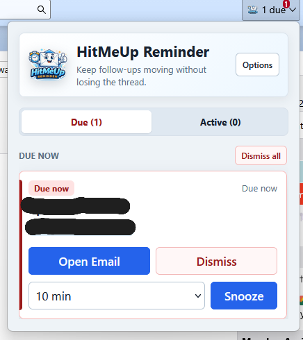
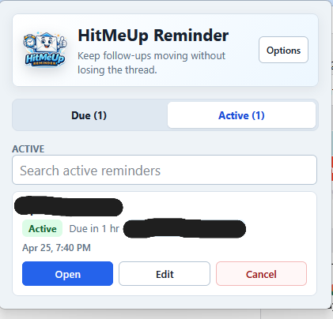
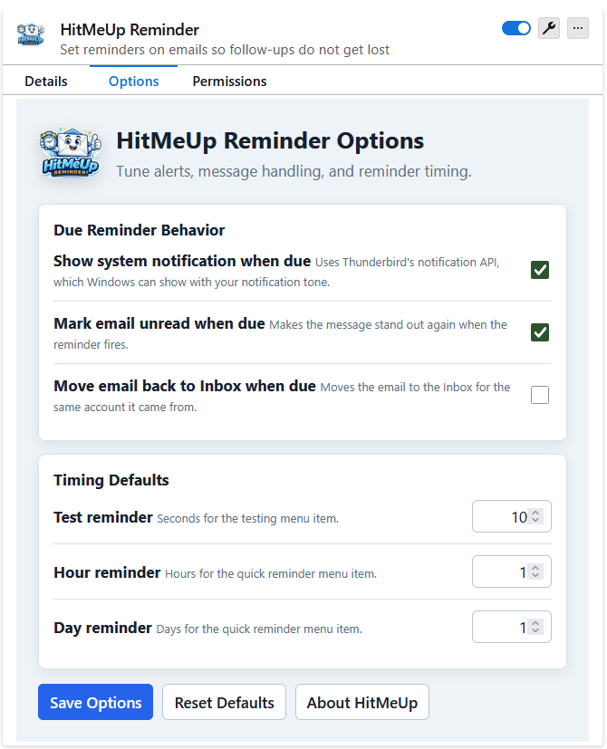

# HitMeUp Reminder

A productivity-focused reminder extension for Mozilla Thunderbird that helps you follow up on important emails at the right time.

HitMeUp lets you set reminders directly from your inbox so messages don’t get forgotten, buried, or lost in the daily flow of communication.

---

## Overview

Email often becomes a task manager by accident.

HitMeUp was built to solve a common problem: remembering to respond, revisit, or act on an email later.

With quick reminder tools, visual badges, due alerts, and snooze actions, HitMeUp helps turn Thunderbird into a more reliable follow-up workflow.

---

## Features

### Quick Reminder Creation

Set reminders directly from any email using the right-click context menu.

Preset options include:

- 10 seconds (testing)
- 1 hour
- 1 day
- Custom date and time

### Toolbar Reminder Center

Access all reminders from the toolbar popup interface.

Organized into:

- **Due** reminders
- **Active** reminders

### Smart Badge Notifications

Toolbar badge displays:

- Active reminder count
- Due reminder alerts
- Color-coded status (red for due, blue for active)

### Due Reminder Actions

When reminders become due, quickly choose:

- Open Email
- Snooze 10 Minutes
- Snooze 30 Minutes
- Snooze 1 Hour
- Snooze Custom Date and Time
- Dismiss

### Desktop Notifications

Receive system notifications when reminders are due.

Supports Thunderbird / Windows notification behavior where available.

---

## Screenshots

### Due Reminder Workflow



### Active Reminders View



### Options Panel



---

## Use Cases

HitMeUp is ideal for:

- Follow-up emails
- Waiting on replies
- Task reminders from incoming messages
- Time-sensitive responses
- Client communication tracking
- Personal inbox organization

---

## Installation

### Temporary Install (Developer Mode)

1. Open Mozilla Thunderbird
2. Go to Add-ons and Themes
3. Select Extensions
4. Choose **Install Add-on From File**
5. Select the provided `.xpi` package

### Packaged Release

Install from the included release build:

```text
dist/HitMeUp-Reminder-1.0.0.xpi
```

---

## Current Version

**1.0.0** — Initial public release

---

## Privacy

HitMeUp is designed with privacy in mind.

- No cloud syncing
- No analytics
- No external tracking
- No data selling
- Reminder data remains local to the Thunderbird environment

See `PRIVACY.md` for details.

---

## Project Status

Current version is stable and functional with core reminder workflows complete.

Ongoing improvements may include:

- recurring reminders
- better sorting/filtering
- theme enhancements

---

## Repository Structure

```text
dist/          Packaged releases
icons/         Extension icons
screenshots/   Interface previews
```

---

## Why It Was Built

Many email users rely on memory or inbox clutter to remember follow-ups.

HitMeUp was created to provide a simple reminder layer inside Thunderbird without unnecessary complexity.

---

## License

Licensed under the MIT License.

---

## Author

Created by Peter Moreno
